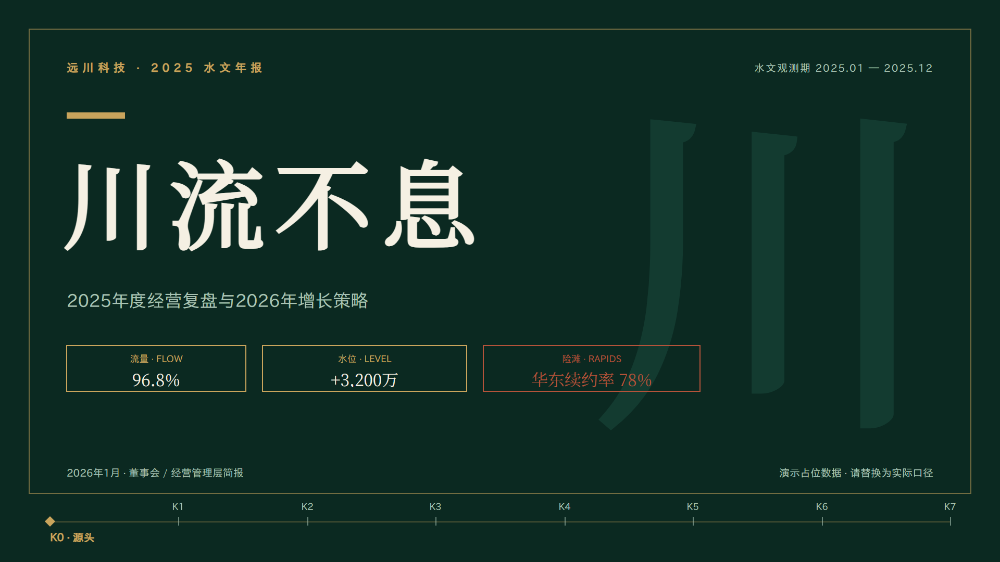
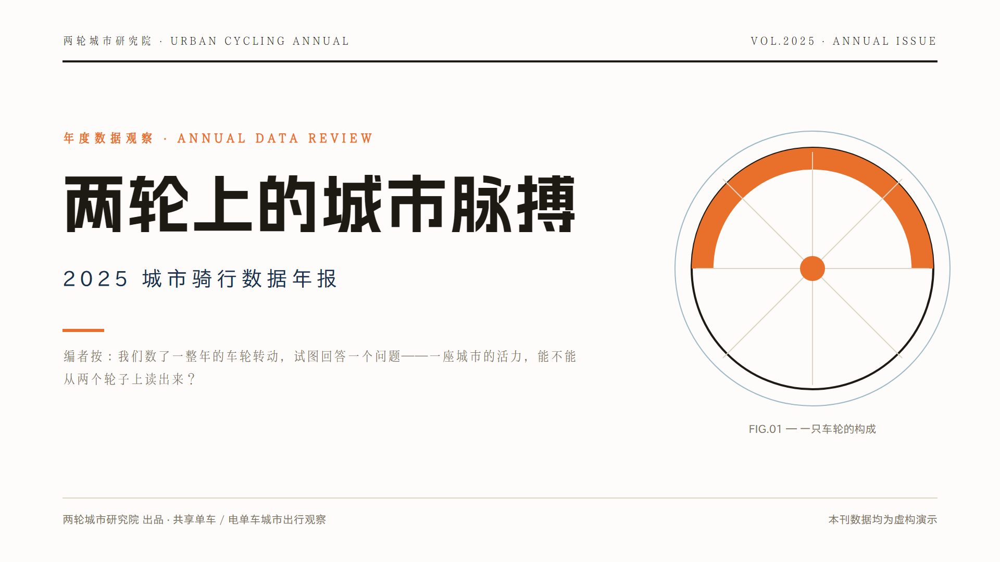
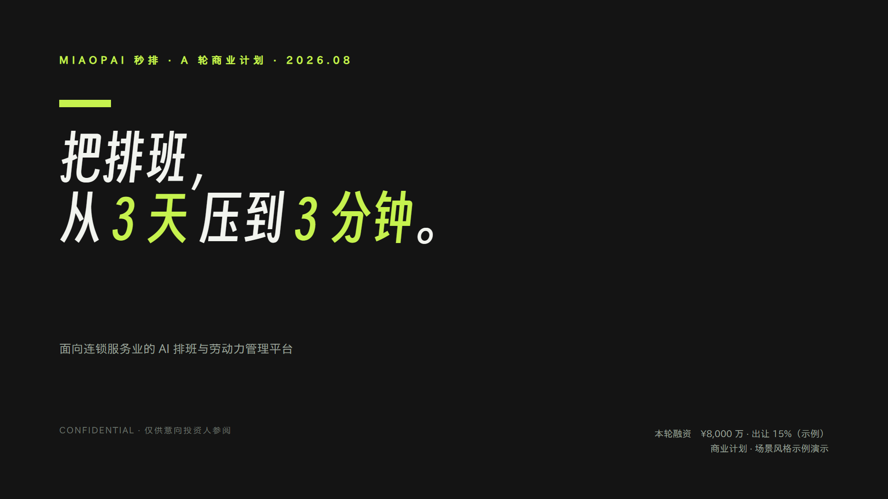
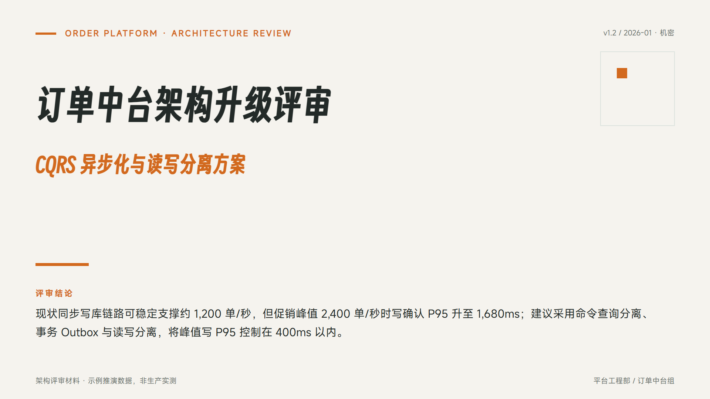

# open-pptd — Local PPTD Presentation Skill

> 🌏 中文版: [README.md](README.md)

A "content → editable project → live preview → PPTX" presentation pipeline that runs entirely locally — **zero dependencies, no network required, no npm install**.

**See it in action 👉 https://shingwha.github.io/open-pptd/**

No installation needed — open the online gallery in a browser: curated decks with live-rendered covers; click a card to open it in the editor, tweak it freely, export PPTX, or download the project bundle (zip) for local editing.

## Example Gallery

The repo ships with 9 curated examples in `examples/` — click an image to open it in the online editor:

<p align="center">
  <a href="https://shingwha.github.io/open-pptd/editor/?deck=examples%2Fbusiness-review-7p%2Fdeck.pptd"></a>
  <a href="https://shingwha.github.io/open-pptd/editor/?deck=examples%2Fcity-cycling-report-7p%2Fdeck.pptd"></a>
  <a href="https://shingwha.github.io/open-pptd/editor/?deck=examples%2Ftide-festival-sponsorship-7p%2Fdeck.pptd"></a>
</p>

<p align="center">
  <a href="https://shingwha.github.io/open-pptd/editor/?deck=examples%2Fmiaopai-saas-bp%2Fdeck.pptd"></a>
  <a href="https://shingwha.github.io/open-pptd/editor/?deck=examples%2Fislelight-brand-book%2Fdeck.pptd"></a>
  <a href="https://shingwha.github.io/open-pptd/editor/?deck=examples%2Fbrand-mori-showcase-7p%2Fdeck.pptd"></a>
</p>

<p align="center">
  <a href="https://shingwha.github.io/open-pptd/editor/?deck=examples%2Fshanmingji-2026-launch%2Fdeck.pptd"></a>
  <a href="https://shingwha.github.io/open-pptd/editor/?deck=examples%2Ftech-architecture-review-7p%2Fdeck.pptd"></a>
  <a href="https://shingwha.github.io/open-pptd/editor/?deck=examples%2Fev-range%2Fdeck.pptd"></a>
</p>

## What It Is

- **PPTD** is a human-readable YAML presentation format: one manifest (`deck.pptd`) + one `pages/*.page` per slide + `media/` images
- A browser-based editor for live preview / collaborative editing (edit files, refresh to apply), exporting standard `.pptx`
- **Preview (browser) = Export (PowerPoint)**: single definition, dual consumers (writer / renderer share the same source)
- Capabilities: 13 chart types, 187 preset shapes + custom paths, LaTeX formula mixing, font embedding, fade slide transitions

> This project is fully self-developed (web editor, PPTX writer, icon library, chart & LaTeX rendering, CLI export pipeline) — no third-party editor code or reverse-engineered implementations.

## Installation

The only prerequisite is **Node.js v18+** (no npm install, no network; render command recommended on Node 21+); browser: Chrome / Edge recommended (needed for the "Open Folder" save feature).

Choose either method, installing into your AI tool's **skills folder** (Claude Code: `~/.claude/skills`; pi: `~/.pi/agent/skills`; others per your tool's configuration). All paths inside the skill are relative to the skill directory, so it works wherever you install it.

**Option 1: download the release zip (recommended — no git needed)**

1. Grab the latest `open-pptd-v*.zip` from the [Releases](https://github.com/Shingwha/open-pptd/releases) page
2. Extract it into your skills folder — you get `<your-skills-folder>/open-pptd/`; to update, re-download and overwrite

**Option 2: git clone (for tracking updates / development)**

```bash
git clone https://github.com/Shingwha/open-pptd <your-skills-folder>/open-pptd
```

### First-time setup: download the font library (optional but recommended)

Font binaries (~155 MB) are not shipped in the package. Choose one of two options before first use:

```bash
# Option A: one-time full download (one and done, ~155 MB, works offline)
node bin/open-pptd.js fonts download all

# Option B: on-demand download (download what you use, run before export)
node bin/open-pptd.js fonts download Smiley Sans
```

> Missing fonts do not block export: they are skipped with a warning at export and the PPTX is still generated (falls back to system fonts when opened).

Once installed, hand it to your AI assistant (`SKILL.md` is the full workflow entry point); CLI usage (serve / export / render / check / fonts) via `node bin/open-pptd.js --help`.

## License

MIT
