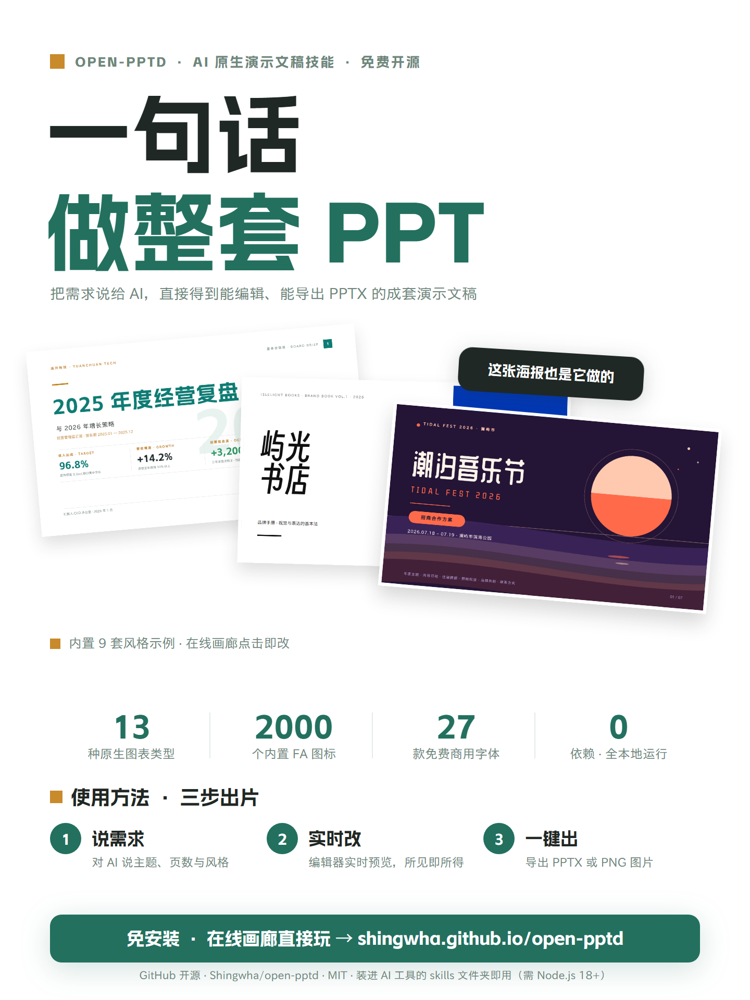
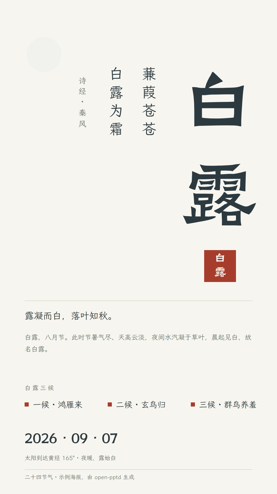

# open-pptd — Local PPTD Presentation Skill

> 🌏 中文版: [README.md](README.md)

A "content → editable project → live preview → PPTX" presentation pipeline that runs entirely locally.

**See it in action 👉 https://shingwha.github.io/open-pptd/** — no installation needed: click a card to open it in the editor, tweak it freely, export PPTX, or download the project bundle for local editing.

## Example Gallery

**Presentations (16:9)**

<p align="center">
  <a href="https://shingwha.github.io/open-pptd/editor/?deck=examples%2Fqingshan-coffee-review-12p%2Fdeck.pptd"></a>
  <a href="https://shingwha.github.io/open-pptd/editor/?deck=examples%2Fbusiness-review-7p%2Fdeck.pptd"></a>
  <a href="https://shingwha.github.io/open-pptd/editor/?deck=examples%2Fbrand-mori-showcase-7p%2Fdeck.pptd"></a>
</p>

**Posters (vertical, `kind: poster`)**

<p align="center">
  <a href="https://shingwha.github.io/open-pptd/editor/?deck=examples%2Fxiaohongshu-intro-poster%2Fdeck.pptd"></a>
  <a href="https://shingwha.github.io/open-pptd/editor/?deck=examples%2Fposter-bailu-solar-term%2Fdeck.pptd"></a>
  <a href="https://shingwha.github.io/open-pptd/editor/?deck=examples%2Fposter-echo-valley-festival%2Fdeck.pptd"></a>
</p>

More examples (consulting decks, data annuals, pitch decks, architecture reviews) live in the online gallery and the `examples/` directory.

## What It Is

- **PPTD**: a human-readable YAML presentation format — one manifest (`deck.pptd`) + one `pages/*.page` per slide + `media/` images
- A browser editor for live preview / collaborative editing (edit files, refresh to apply), exporting standard `.pptx`; **preview (browser) = export (PowerPoint)** — writer / renderer share the same source
- Capabilities: 13 chart types, 187 preset shapes + custom paths, ~2000 Font Awesome icons (three styles), LaTeX formula mixing, font embedding (subset / complete), fade slide transitions

> Fully self-developed (web editor, PPTX writer, chart & LaTeX rendering, CLI export pipeline) — zero dependencies, no npm install, no network; icons by [Font Awesome Free](https://fontawesome.com/license/free) (CC BY 4.0).

## Quick Start

### 1. Install

The only prerequisite is **Node.js v18+** (Node 21+ recommended for the render command); Chrome / Edge recommended (needed for the "Open Folder" save feature).

Install into your AI tool's **skills folder** (`~/.claude/skills` for Claude Code, `~/.pi/agent/skills` for pi, others per your tool's configuration; all paths inside the skill are relative, so it works wherever you install it) — pick one:

- **Release zip (recommended — no git needed)**: grab `open-pptd-v*.zip` from [Releases](https://github.com/Shingwha/open-pptd/releases) and extract it into the skills folder; overwrite to update
- **git clone (for tracking updates / development)**:

```bash
git clone https://github.com/Shingwha/open-pptd <your-skills-folder>/open-pptd
```

**Font library (optional but recommended)**: font binaries (~155 MB) are not bundled; download before first use. Missing fonts do not block export (embedding is skipped with a warning; falls back to system fonts when opened).

```bash
node bin/open-pptd.js fonts download all          # one-time full download, works offline
node bin/open-pptd.js fonts download Smiley Sans  # on demand, run before export
```

### 2. Use It Through Conversation

Once installed, no extra configuration is needed — just describe the task to your AI assistant (Claude Code, pi, etc.), for example:

- "Make me a 7-page annual business review deck; tell the story with charts"
- "Turn this outline into a presentation" + paste the outline
- "Design a Bailu solar-term poster"

Following the `SKILL.md` workflow, the AI delivers **two things**: an editable PPTD project directory (manifest + pages + media), and a ready-to-send `.pptx` (fonts embedded, transitions applied).

To watch the deck being built live, have the AI start a local preview server (or run it yourself):

```bash
node bin/open-pptd.js serve --project <project-dir>   # open in browser; every page shows up as it's written
```

Other CLI commands: `export` (PPTX) / `render` (PNG) / `check` (validate a project) / `fonts` — see `node bin/open-pptd.js --help`.

### 3. What the Web Editor Does

Click any card in the online gallery to edit it (no installation); local projects get the same feature set via `serve`:

- **Live preview**: refreshes on every file change (SSE), WYSIWYG
- **Element editing**: click-to-edit text/shapes/images/tables with a property panel
- **Chart editor**: Excel-style data grid + 13 chart types with style panels
- **Export**: PPTX (fonts embedded, opens in PowerPoint without repair) and PNG images
- **Project round-trip**: download a project bundle, or "Open Folder" to edit local projects directly

## License

MIT
