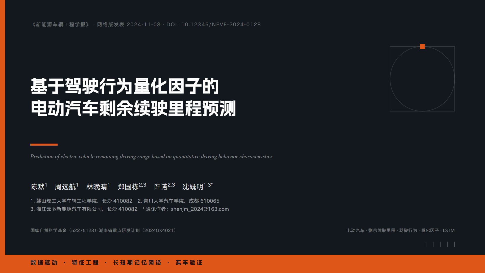

# open-pptd — 本地 PPTD 演示文稿技能

> 🌏 English version: [README.en.md](README.en.md)

一套「内容 → 可编辑项目 → 实时预览 → PPTX」的演示文稿生成闭环，全部在本地运行，**零依赖、无需联网、无需 npm install**。

**先去线上画廊看效果 👉 https://shingwha.github.io/open-pptd/**

无需安装，浏览器直接打开：精选示例封面实时渲染，点卡片进编辑器随意修改、导出 PPTX，或下载项目包（zip）带回本地继续编辑。

## 示例画廊

仓库自带 5 套精选示例（`examples/`），点击标题直接在线打开编辑：

| 示例 | 场景 | 亮点 |
|---|---|---|
| [屿间咖啡经营月报](https://shingwha.github.io/open-pptd/editor/?deck=examples%2Fcoffee-monthly-report%2Fdeck.pptd) | 管理汇报 · 5 页 | 六类原生图表 + KPI 卡片 + 三线表 |
| [电动汽车续驶里程预测](https://shingwha.github.io/open-pptd/editor/?deck=examples%2Fev-range%2Fdeck.pptd) | 学术答辩 · 17 页 | LaTeX 公式混排、图片排版、章节结构 |
| [屿光品牌手册](https://shingwha.github.io/open-pptd/editor/?deck=examples%2Fislelight-brand-book%2Fdeck.pptd) | 品牌创意 · 7 页 | 克莱因蓝瑞士海报风、黑白摄影构图 |
| [秒排 A 轮商业计划](https://shingwha.github.io/open-pptd/editor/?deck=examples%2Fmiaopai-saas-bp%2Fdeck.pptd) | 融资 BP · 7 页 | 墨黑 × 荧光黄绿撞色、TAM/SAM/SOM 嵌套图、时间线 |
| [山茗集品牌发布会](https://shingwha.github.io/open-pptd/editor/?deck=examples%2Fshanmingji-2026-launch%2Fdeck.pptd) | 新中式 · 7 页 | 表格、图片、中式装饰版式、三字体混排 |

<p align="center">
  
  
</p>

<p align="center">
  
</p>

## 这是什么

- **PPTD** 是人类可读的 YAML 演示格式：一个 manifest（`deck.pptd`）+ 每页一个 `pages/*.page` + `media/` 图片
- 浏览器网页编辑器实时预览/共同修改（改文件刷新即生效），最终导出标准 `.pptx`
- **预览（浏览器）= 导出（PowerPoint）**：单一定义、双消费者（writer / renderer 同源）
- 能力覆盖：13 种图表、187 种预置形状 + 自定义路径、LaTeX 公式混排、字体嵌入、淡入淡出转场

> 本项目实现完全独立、全部自研（网页编辑器、PPTX writer、图标库、图表与 LaTeX 渲染、CLI 导出链路），未使用任何第三方编辑器代码或逆向实现。

## 安装

前置仅 **Node.js v18+**（无需 npm install、无需联网；render 命令推荐 Node 21+）；浏览器推荐 Chrome / Edge（「打开文件夹」保存功能需要）。

二选一：

**方式一：下载发布包（推荐，无需 git）**

1. 到 [Releases](https://github.com/Shingwha/open-pptd/releases) 页面下载最新的 `open-pptd-v*.zip`
2. 解压到你的 AI 工具的 **skills 文件夹**，得到 `<skills 文件夹>/open-pptd/`；更新时重新下载覆盖即可

**方式二：git clone（适合跟踪更新 / 参与开发）**

```bash
git clone https://github.com/Shingwha/open-pptd <你的 skills 文件夹>/open-pptd
```

> clone 会带上 tests/docs/examples 等开发内容；发布包只含 skill 运行时，更轻量。

skills 文件夹的位置因工具而异：

| AI 工具 | skills 文件夹 |
|---|---|
| Claude Code | `~/.claude/skills` |
| pi | `~/.pi/agent/skills` |
| 其他自定义目录 | 按你的工具配置 |

> 技能内所有路径均相对 skill 目录，装到哪里都能直接工作。

### 首次使用：下载字体库（可选但推荐）

字体文件本体（约 155MB）不入包，首次使用前二选一：

```bash
# 方案 A：一次全量下载（一劳永逸，约 155MB，离线可用）
node bin/open-pptd.js fonts download all

# 方案 B：按需下载（用到哪个下哪个，导出前跑）
node bin/open-pptd.js fonts download 得意黑
```

> 未下载字体不影响导出：导出时自动跳过嵌入并告警，PPTX 照常生成（打开时回退系统字体）。

## 快速开始

```bash
# 1. 创建项目目录
mkdir -p /path/to/项目目录/pages /path/to/项目目录/media

# 2. AI 助手流程：先写 deck.pptd（完整 pages 清单 + 主题 + 字体声明），
#    随即后台启动实时预览（生成页面时用户即可实时看到逐页出现）：
nohup node bin/open-pptd.js serve --project /path/to/项目目录 > /tmp/open-pptd-serve.log 2>&1 &
#    浏览器打开日志中打印的链接，再生成全部 pages/*.page——每落盘一页自动刷新出现

# 3. 命令行导出 PPTX / 项目包 / 页面图片
node bin/open-pptd.js export /path/to/项目目录/deck.pptd -o out.pptx
node bin/open-pptd.js export-project /path/to/项目目录/deck.pptd -o project.zip
node bin/open-pptd.js render /path/to/项目目录/deck.pptd -o 图片目录
#   render：逐页渲染为 PNG（960×540，无头浏览器静默工作，与编辑器预览同一条渲染管线）
#   可选参数：--page 3（单页） --scale 2（放大） --browser <路径> --timeout <毫秒>
#   注意：render 仅在需要图片级视觉检查时使用（用户要求 agent 自行检查布局且模型支持读图）

# 4. 人工使用：前台启动网页编辑器实时预览/编辑/导出
node bin/open-pptd.js serve --project /path/to/项目目录 --port 55173
# 浏览器打开启动时打印的链接
```

格式规范按需查阅 `references/`：`pptd.md`（PPTD v2 完整规范，**一切格式决策的唯一依据**）、`shapes.md`（187 种预置形状）、`fonts.md`（字体清单）、`icons.md`（图标清单）、`slides_categories.md`（各场景排版方案）、`general-poster.md`（海报/信息图单页设计）。

## 作为 AI 技能使用

把整个目录作为 skill 安装（SKILL.md 是入口）。AI 会按以下流程工作：

1. 与用户确认内容/场景 → 确定主题（配色/字体/表格样式，生成时一次性设计决策写入 `deck.theme`；编辑器内置 10 套配色预设可一键替换 `theme.colors`，CLI 导出支持 `--theme <key>`）
2. 先写 `deck.pptd`（完整 pages 清单 + theme + fonts），**随即后台启动 `serve --project` 实时预览**（nohup，URL 交给用户），再一次性生成全部 `pages/*.page` —— 用户全程实时看到页面逐个出现，可随时打断提意见
3. 结构性校验始终执行；**页面图片渲染（`render`）严格按需**：仅当用户明确要求 agent 自行检查/调整视觉效果，且模型支持读图、本机有浏览器时才执行
4. 导出 `.pptx` 交付（默认嵌入字体 + 淡入淡出转场），交付时附预览服务状态

## 目录结构

```
open-pptd/
├── SKILL.md                  # 给 AI 助手的完整工作流说明
├── README.md                 # 本文档（给人看，中文）
├── README.en.md              # 英文版本文档
├── index.html                # 作品画廊入口（GitHub Pages 站点根）
├── examples/                 # 画廊示例项目（deck.pptd + pages/ + media/ + 可选 meta.yaml）
├── bin/open-pptd.js          # CLI（serve / export / export-project / render / fonts / gallery）
├── lib/                      # 本地服务器（静态 + SSE 实时刷新 + 保存写回）+ 导出/渲染逻辑
├── editor/                   # 网页编辑器（纯前端，无后端依赖）
│   ├── core/                 #   数据模型 / 富文本 / 主题 / 几何 / 图标库
│   ├── writer/               #   PPTX writer（OOXML 生成，与 PowerPoint 结构对齐）
│   ├── renderer/             #   预览渲染（与 writer 同源）
│   ├── types/                #   元素类型注册表（text/shape/line/image/icon/table/chart）
│   └── app/                  #   编辑器装配（状态/视图/IO/工具栏）
├── assets/                   # 内置资源（icons/ 图标源；fonts/ 字体库 29 种免费商用字体，本地资源不上传 GitHub）
├── references/               # 按需读取的参考文档（pptd.md / shapes.md / fonts.md / icons.md / …）
├── scripts/                  # 构建脚本（图标库 / 预置几何 / 参考文件生成 / 发布打包）
├── tests/                    # 测试（见 tests/README.md：组件项目 + 一键回归 + E2E）
└── package.json
```

## 开发

### 画廊投稿

线上画廊由本仓库经 GitHub Pages 部署，提交后 CI 自动「回归测试 → 重建画廊索引 → 部署」。把自己的作品加入画廊：把做好的项目文件夹（`deck.pptd` + `pages/` + `media/`，可选 `meta.yaml` 补充标题/描述/标签）放进 `examples/<名称>/`，本地 `serve` 自动扫描即可预览，运行 `node bin/open-pptd.js gallery scan` 重建索引后提交推送。

### 测试

```bash
npm test                      # 一键回归：导出全部组件项目 + 包一致性 + 颜色 + 形状全量 + 公式 + 图标
npm run test:live             # 项目模式 E2E（SSE 实时刷新 + 保存写回磁盘，需 Chrome）
npm run test:incremental      # 渐进加载 E2E（写入中的项目逐页显示，需 Chrome）
```

详见 `tests/README.md`（发布 zip 不含测试）。

### 发布

push `v*` tag（如 `v1.1.0`，需与 package.json 版本一致）后，CI 自动「回归测试 → 按白名单打包 → 创建 GitHub Release」，附件 `open-pptd-v*.zip` 即安装方式一下载的发布包。完整流程与本地试打包（`npm run pack`）见 **[docs/release-workflow.md](docs/release-workflow.md)**。

> 旧发布仓库 [open-pptd-publish](https://github.com/Shingwha/open-pptd-publish) 已于 2026-08 退役归档，请改用发布包或 clone 本仓库。

## License

MIT
