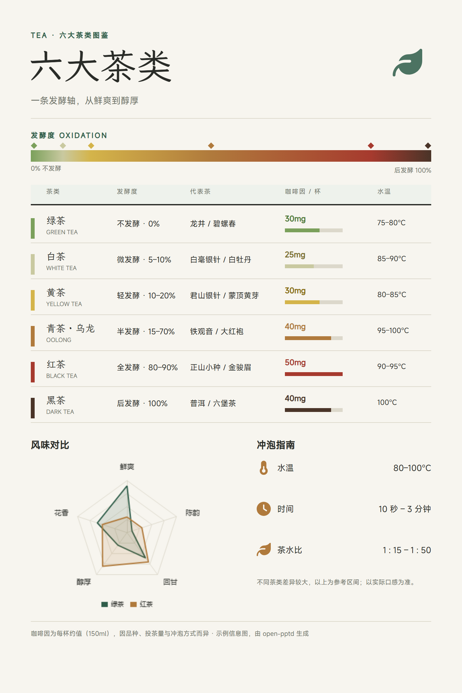

# open-pptd — 本地 PPTD 演示文稿技能

> 🌏 English version: [README.en.md](README.en.md)

一套「内容 → 可编辑项目 → 实时预览 → PPTX」的演示文稿生成闭环，全部在本地运行。

**先去线上画廊看效果 👉 https://shingwha.github.io/open-pptd/** ——无需安装，点卡片进编辑器随意修改、导出 PPTX，或下载项目包带回本地继续编辑。

## 示例画廊

**演示文稿（16:9）**

<p align="center">
  <a href="https://shingwha.github.io/open-pptd/editor/?deck=examples%2Fqingshan-coffee-review-12p%2Fdeck.pptd"></a>
  <a href="https://shingwha.github.io/open-pptd/editor/?deck=examples%2Fbusiness-review-7p%2Fdeck.pptd"></a>
  <a href="https://shingwha.github.io/open-pptd/editor/?deck=examples%2Fbrand-mori-showcase-7p%2Fdeck.pptd"></a>
</p>

**海报（竖版，`kind: poster`）**

<p align="center">
  <a href="https://shingwha.github.io/open-pptd/editor/?deck=examples%2Fxiaohongshu-intro-poster%2Fdeck.pptd"></a>
  <a href="https://shingwha.github.io/open-pptd/editor/?deck=examples%2Fposter-artdeco-latelier%2Fdeck.pptd"></a>
  <a href="https://shingwha.github.io/open-pptd/editor/?deck=examples%2Fposter-echo-valley-festival%2Fdeck.pptd"></a>
  <a href="https://shingwha.github.io/open-pptd/editor/?deck=examples%2Fposter-six-tea-types%2Fdeck.pptd"></a>
  <a href="https://shingwha.github.io/open-pptd/editor/?deck=examples%2Fposter-bailu-solar-term%2Fdeck.pptd"></a>
</p>

更多示例（咨询简报、数据年报、BP、架构评审等）见线上画廊与 `examples/` 目录。

## 这是什么

- **PPTD**：人类可读的 YAML 演示格式——一个 manifest（`deck.pptd`）+ 每页一个 `pages/*.page` + `media/` 图片
- 网页编辑器实时预览/共同修改（改文件刷新即生效），导出标准 `.pptx`；**预览（浏览器）= 导出（PowerPoint）**，writer / renderer 同源
- 能力覆盖：13 种图表、187 种预置形状 + 自定义路径、约 2000 个 Font Awesome 图标（三风格）、LaTeX 公式混排、字体嵌入（子集 / 完整）、淡入淡出转场

> 编辑器、PPTX writer、图表与 LaTeX 渲染、CLI 导出全部自研，零依赖、无需 npm install、无需联网；图标采用 [Font Awesome Free](https://fontawesome.com/license/free)（CC BY 4.0）。

## 快速开始

### 1. 安装

前置仅 **Node.js v18+**（render 命令推荐 21+）；浏览器推荐 Chrome / Edge（「打开文件夹」保存功能需要）。

装到 AI 工具的 **skills 文件夹**（Claude Code 在 `~/.claude/skills`，pi 在 `~/.pi/agent/skills`，其他工具按其配置；技能内路径均相对 skill 目录，装到哪里都能直接工作），二选一：

- **发布包（推荐，无需 git）**：[Releases](https://github.com/Shingwha/open-pptd/releases) 下载 `open-pptd-v*.zip` 解压即得 `<skills>/open-pptd/`，更新时覆盖
- **git clone（跟踪更新 / 参与开发）**：

```bash
git clone https://github.com/Shingwha/open-pptd <你的 skills 文件夹>/open-pptd
```

**字体库（可选但推荐）**：字体本体约 155MB 不入包，首次使用前下载；不下载不影响导出（跳过嵌入并告警，打开时回退系统字体）。

```bash
node bin/open-pptd.js fonts download all      # 全量，一劳永逸，离线可用
node bin/open-pptd.js fonts download 得意黑   # 按需，导出前跑
```

### 2. 和 AI 对话使用

装好后无需任何配置，直接对 AI 助手（Claude Code、pi 等）说需求就行，例如：

- 「帮我做一份 7 页的年度经营复盘 PPT，数据用图表讲」
- 「把这份大纲做成演示文稿」+ 粘贴大纲
- 「做一张白露节气主题海报」

AI 会按 `SKILL.md` 的工作流交付**两样东西**：可编辑的 PPTD 项目目录（manifest + pages + media），以及直接可发的 `.pptx`（字体嵌入、转场就绪）。

想实时围观生成过程，让 AI 起本地预览服务（或自己跑）：

```bash
node bin/open-pptd.js serve --project <项目目录>   # 浏览器打开，AI 每写一页你就能看到
```

其他 CLI：`export`（导出 PPTX）/ `render`（渲染 PNG）/ `check`（校验项目）/ `fonts`（字体管理），见 `node bin/open-pptd.js --help`。

### 3. 网页编辑器能做什么

线上画廊点任意卡片即可编辑（无需安装）；本地项目用 `serve` 起服务后功能相同：

- **实时预览**：改文件即刷新（SSE），所见即所得
- **元素编辑**：文字/形状/图片/表格点选即改，属性面板调样式
- **图表编辑器**：Excel 式数据网格 + 13 种图表类型切换与样式面板
- **导出**：PPTX（字体嵌入、PowerPoint 打开零修复）与 PNG 图片
- **项目互通**：下载项目包带回本地，或「打开文件夹」直接编辑本地项目

## License

MIT
