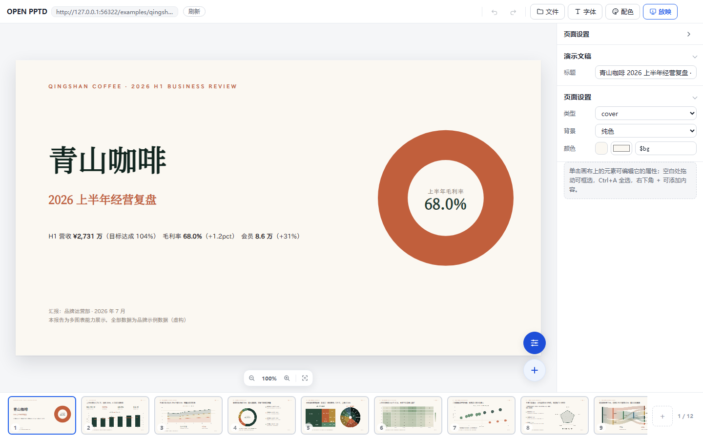
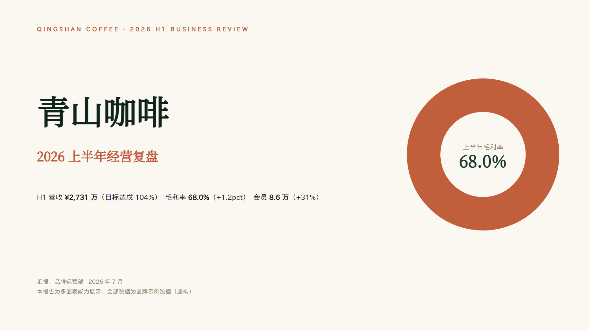
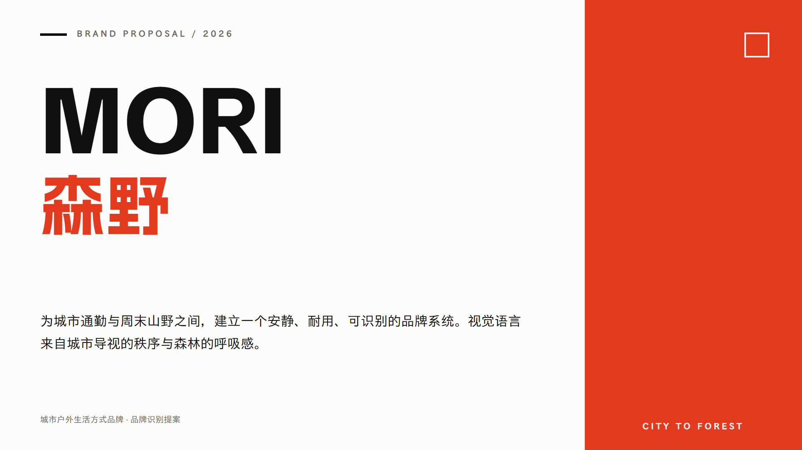
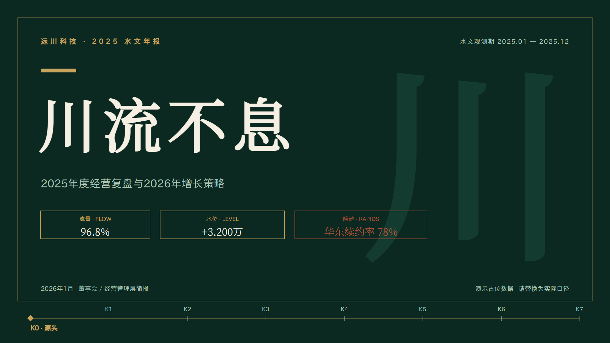
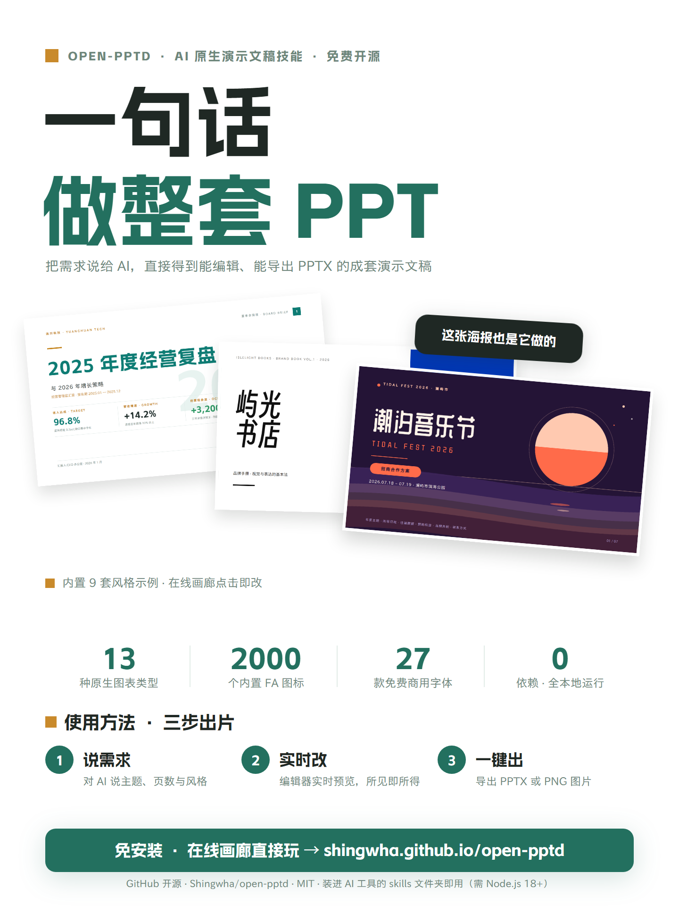
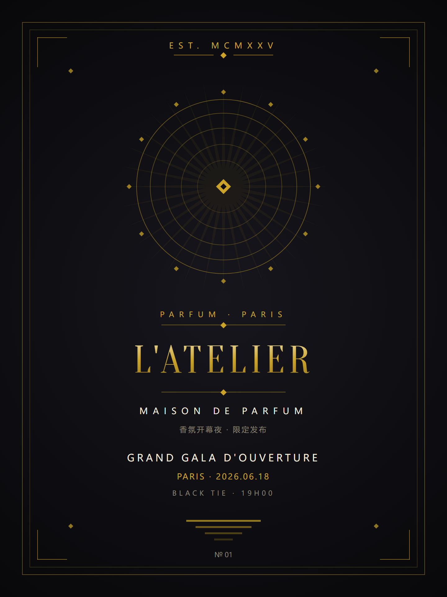
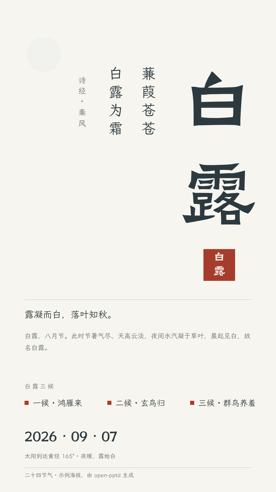

<div align="center">

# open-pptd

**对 AI 说一句话，得到可编辑、可导出的 PPT 与海报。**

`v2.0.0` · `MIT` · `Node ≥ 18` · `零依赖 · 零构建`

English: [README.md](README.md)

[线上画廊](https://shingwha.github.io/open-pptd/)（免安装，点开即改）· [30 秒安装](#30-秒上手) · [和 AI 一起用](#和-ai-一起用)



</div>

---

## 30 秒上手

前置只有一个：**Node.js ≥ 18**。

**Windows（PowerShell）**

```powershell
irm https://raw.githubusercontent.com/Shingwha/open-pptd/main/install.ps1 | iex
```

**macOS / Linux**

```sh
curl -fsSL https://raw.githubusercontent.com/Shingwha/open-pptd/main/install.sh | sh
```

装到 `~/.open-pptd` 并写入用户级 PATH（不需要管理员），装完 `open-pptd` 全局可用。起一个本地预览服务：

```sh
open-pptd serve --project <项目目录> --detach --json   # 浏览器打开，改文件实时刷新
open-pptd doctor                                        # 环境自检（CLI / Node / 资源 / PATH）
```

不装也行：clone 本仓库后 `node bin/open-pptd.js serve …` 效果相同。

## 和 AI 一起用

把技能包装进 AI 工具的技能目录（Claude Code 在 `~/.claude/skills`，pi 在 `~/.pi/agent/skills`，其他工具按其配置）：

```sh
git clone https://github.com/Shingwha/open-pptd-skill <你的技能目录>/open-pptd
```

然后直接说人话，无需任何配置：

- 「帮我做一份 7 页的年度经营复盘，用图表讲故事」
- 「把这份大纲做成演示文稿」+ 粘贴大纲
- 「做一张白露节气主题海报」

AI 会交付**两样东西**：可编辑的 PPTD 项目目录（manifest + pages + media），以及可直接发送的 `.pptx`（字体已嵌入、PowerPoint 打开零修复）。想围观生成过程，让 AI 跑上面的 `serve`，每写一页你就能看到。

## 能做什么

| | |
|---|---|
| **图表** | 13 种类型，Excel 式数据网格改数即改图 |
| **形状 / 图标** | 187 种预置形状 + 自定义路径；约 2000 个 Font Awesome 图标（三风格） |
| **排版** | LaTeX 公式混排；字体嵌入（子集 / 完整，导出前自动体检补齐缺失字体） |
| **网页编辑器** | 实时预览（改文件即刷新）、多选 / 框选 / 右键菜单 / 组合对齐分布、13 种图表编辑器、深色模式 |
| **导出** | 标准 `.pptx`（淡入淡出转场）与逐页 PNG |
| **项目互通** | 线上作品可下载项目包带回本地，本地项目可「打开文件夹」直接编辑 |

**预览 = 导出**：浏览器里看到的和 PowerPoint 里打开的是同一条渲染管线，像素级一致——这是本项目的核心承诺，由 156 页黄金基线逐页守门。

## 原理

```
你说的话 ──AI（open-pptd-skill 方法论）──▶ PPTD 项目（人类可读 YAML：manifest + pages/ + media/）
                                              │
                            ┌─────────────────┴─────────────────┐
                        网页编辑器实时预览                    PPTX 导出
                            └──────── 同一条渲染管线 ───────────┘
```

- **本仓库**：引擎（packages/*）+ 网页编辑器 + CLI。零 npm 依赖、零构建，全部自研
- **[open-pptd-skill](https://github.com/Shingwha/open-pptd-skill)**：给 AI 看的方法论（纯 markdown），教 AI 怎么写好一份 PPTD
- 字体库（约 155 MB）不入包：导出时按需自动下载真正用到的，也可 `open-pptd assets sync fonts` 全量预存

## 示例画廊

<p align="center">
  <a href="https://shingwha.github.io/open-pptd/editor/?deck=examples%2Fqingshan-coffee-review-12p%2Fdeck.pptd"></a>
  <a href="https://shingwha.github.io/open-pptd/editor/?deck=examples%2Fbrand-mori-showcase-7p%2Fdeck.pptd"></a>
  <a href="https://shingwha.github.io/open-pptd/editor/?deck=examples%2Fbusiness-review-7p%2Fdeck.pptd"></a>
</p>
<p align="center">
  <a href="https://shingwha.github.io/open-pptd/editor/?deck=examples%2Fxiaohongshu-intro-poster%2Fdeck.pptd"></a>
  <a href="https://shingwha.github.io/open-pptd/editor/?deck=examples%2Fposter-artdeco-latelier%2Fdeck.pptd"></a>
  <a href="https://shingwha.github.io/open-pptd/editor/?deck=examples%2Fposter-bailu-solar-term%2Fdeck.pptd"></a>
</p>

更多示例（数据年报、BP、架构评审、音乐节海报等）见[线上画廊](https://shingwha.github.io/open-pptd/)与 `examples/` 目录——每张卡片点开就是一个可编辑的项目。

## CLI 速查

| 命令 | 作用 |
|---|---|
| `open-pptd serve --project <目录> --detach --json` | 本地预览服务（实时刷新；`--stop` 停止） |
| `open-pptd export <deck.pptd>` | 导出 PPTX（自动体检并补齐字体；`--json` 结构化输出） |
| `open-pptd render <deck.pptd>` | 逐页渲染 PNG |
| `open-pptd check <deck.pptd>` | 结构 / 令牌 / 几何 / 对比度校验 |
| `open-pptd doctor` / `paths` / `assets sync` | 环境自检 / 路径 / 字体图标资源管理 |

## License

MIT · 图标基于 [Font Awesome Free](https://fontawesome.com/license/free)（CC BY 4.0）
